The most basic technique for proving correctness in IVy is to
construct an inductive invariant. IVy makes this easier by providing
tools to visualize the failures of inductive proofs and suggest
possible refinements to the proof.

An *safety invariant* is a formula or a set of formulas that has the
following properties:

- *initiation*: It is true in all initial states of the program.

- *safety*: If it is true in a program state, then no exported action
can cause an assertion failure starting in that state.

- *consecution*: If it is true in a state, then after executing any
exported action, the formula remains true.

In this example, we will use IVy's CTI method. CTI stands for
"counter-example to induction". If one of the above conditions fails,
IVy tries to construct a *simple* example of the failure. We can
attempt to correct the proof by *generalizing* from this
counter-example.

# An abstract protocol model

The following is a very abstract model of a protocol that establishes
connections between clients and servers. Each server has a semaphore
that is used to guarantee that at any time at most one client can be
connected to the server.

    #lang ivy1.7

    type client
    type server

    relation link(X:client, Y:server)
    relation semaphore(X:server)

    after init {
        semaphore(W) := true;
        link(X,Y) := false
    }

    action connect(x:client,y:server) = {
      require semaphore(y);
      link(x,y) := true;
      semaphore(y) := false
    }

    action disconnect(x:client,y:server) = {
      require link(x,y);
      link(x,y) := false;
      semaphore(y) := true
    }

    export connect
    export disconnect

This program declares two types `client` and `server`. The state of
the protocol model consists of two relations. The relation `link`
tells us which clients are connected to which servers, while
`semaphore` tells us which servers have their semaphore "up".

The program exports two actions to the environment: `connect` and
`disconnect`. The `connect` actions creates a link from client `x` to
server `y`, putting the server's semaphore down. Notice that `connect`
requries that the server's semaphore be initially up. The `disconnect`
action removes a link and puts the semaphore up. It requires that the
link be initially established. The two `export`
declarations at the end tell us that the environment may call
`connect` and `disconnect` in arbitrary sequence, though it must obey
the stated requirements.

## Safety and invariant conjectures

A program is *safe* if the environment cannot call it in any way that
causes an assertion to be false. There are various way to use
assertions to specify desired safety properties of a program. A simple
one is to add an *invariant*. This is a formula that must hold true between calls
to the program's actions.  In the client/server example above, we might specify that no
two distinct clients can be connected to a single server using the
following assertion:

    invariant ~(X ~= Z & link(X,Y) & link(Z,Y))

The invariant assertion is implicitly universally quantified over
(distinct) clients `X` and `Z` and server `Y`.

# Discovering a safety invariant

The invariant we sepficied above is true, but, as we will see, it
isn't a safety invariant because it doesn't satisfy the consecution
property.  To try to construct a safety invariant for this program, we
run IVy in its CTI mode. Download the file
[client_server_example.ivy](client_server_example.ivy) or just copy
the above IVy text (both parts) into a file
`client_server_example.ivy`. Then use this command to start IVy:

    $ ivy ui=cti client_server_example.ivy

This produces the following rather uninformative display:

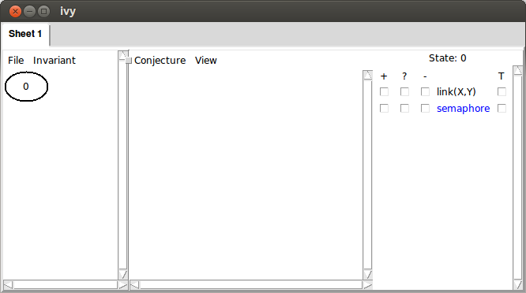

Let's ask IVy to check our invariant. We select the `Check induction`
operation, like this:

Here's what IVy says:

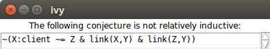

It is telling us that our conjectured invariant fails the consecution test.
When we click OK, we see the counter-example to induction:

On the left-hand side of the display, we see a transition of the
program from a state labeled `0` to a state labeled `1`. The action
labeling the transition arrow can tell us something about how we get
from state `0` to state `1` (and in particular, how our invariant
fails). For the moment, though, let's concentrate on the
right-hand side. Here, we see a representation of state `0`, the one just
before the invariant is violated. It shows one server (arbitrarily numbered `0`)
and two clients (numbered `0` and `1`).  

IVy has already displayed the `link` relation, since it occurs in our conjectured
invariant. The red arrows show the link relationships between the clients and the
server (notice that on the right, the relation `link(X,Y)` is in red). If you click on the
bubble numbered `1` on the left, you'll see the next state, occurring after a connect. 
In this state, both clients are connected to the server, which violates our invariant.

In state zero, however, what we can see is not unexpected. There is
just one client connected to the server, which is what we expect
from the protocol. To find out what's wrong with this state, we need
to reveal more information. 
The check-boxes on the right allow us to
display further information about the state.
Checking the box to view the `semaphore`
relation, we observe the following:

Notice that the `server` node is now labeled with `semaphore`, meaning
that `semaphore` is true for this node (if it were false, the label would
be `~semaphore`. This is clearly the problem. When a client is connected,
the semaphore should be down. We will conjecture that in fact
this 'bad pattern' never occurs. To do this we select the `Gather` option
from the `Conjecture` menu. When then see the following:

IVy has collect three facts about the displayed state, shown under the
heading 'Constraints'. These facts are a logical representation of the
bad pattern we observed graphically: there are two distinct nodes,
one of which is connected to the server and the server's semaphore is up.

Also notice that the nodes and the arcs in the graph have been highlighted
to indicate that they are all used in the listed facts.

Since we think that this particular pattern should never occur, we will
generalize it to produce new conjectured invariant about the program
state. Choosing the `Strengthen` option from the `Conjecture` menu, we
see:

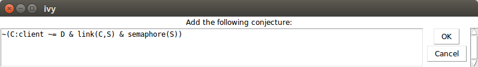

IVy is suggesting to add this fact to the list of conjectured invariants:

    ~(C:client ~= D & link(C,S) & semaphore(S))

This says that we cannot have two distinct clients, where one of them
is linked to the server and the semaphore is up. We click OK, adding this formula to our list of
conjectured invariants. 

We can now try checking inductiveness again with our new conjecture.
We see the following:

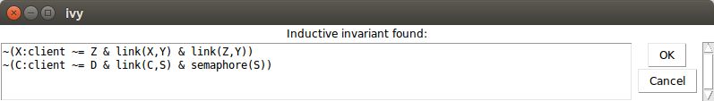

We now have a proof that our program is safe. Of course, we want to
save that proof so we can use it again later. We select `Save invariant` from
the `File` menu and enter a file name:

Here is the content of the file:

    # new conjectures

    conjecture ~(C:client ~= D & link(C,S) & semaphore(S))

If we add this text to the input file and run IVy again, IVy will use
these conjectures and immediately observe that they are inductive.

# Generalization tools

Let's consider the process we just used to arrive at an inductive
invariant. We took the following steps:

- Find a simple counterexample to induction

- Identify relevant facts about the counter-example

- Generalize to form a universally quantified conjecture

The first and last steps were done automatically by IVy. However, we
performed the second step manually, by select which relations to
display. 

There are several ways in which we can get some automated help with
this task. Let's go back to the counterexample in which one client is
connected, but the semaphore is up:

This pattern actually contains an irrelevant fact. That is, our bad
pattern requires that there are two distinct nodes, `0` and `1`. In
fact, we do need two nodes to have a safety violation (that is, to
have two nodes connected to one server). Notice, though, that if we drop
this fact from the pattern, we still have a pattern that we can rule out,
that is, `semaphore(0)` and `link(0,0)`. 

To check this idea, we remove the irrelevant fact from the pattern by clicking on it.
The unwanted fact becomes gray:

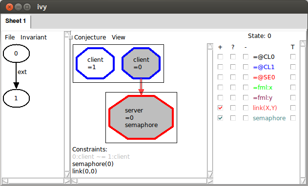

When we strengthen using this pattern, we get this:

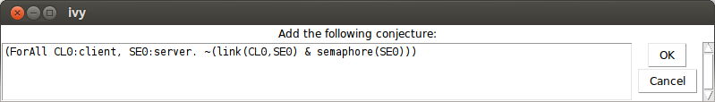

That is, our new conjecture says that no client can be connected to a
server with the semaphore up, but it doesn't depend on the existence
of any other client. We can verify that with this conjecture, we still
have an inductive invariant.

This illustrates an important point about inductive invariants: there
are many of them.  This give us the flexibility to find a simple one.
By dropping a fact from the bad pattern, we effectively generalized
it.  That is, we ruled out a larger class of states, so in effect we
made a *stronger* conjecture. 

IVy can often discover automatically that a bad pattern can be
generalized.  One way to do this is to use *bounded
reachability*. After `Gather`, Instead of manually eliminating the
unwanted facts, we can select `Minimize` from the `Conjecture`
menu. IVy ask for the number of steps to check. Somewhat arbitrarily,
we choose four. This is the result we get:

IVy has recognized that there is a more general pattern that can be
ruled out if we consider only four steps of execution of the protocol.
Its conjecture is that if any client is connected to a server, that
server's semaphore is down. This fact is definitely true after four
steps of execution, but it's still a conjecture. If we're suspicious
that it might not be invariantly true, we could try five steps, six
steps, and so on until we are convinced, or until the IVy gets too
slow.

We can add IVY's generalized conjecture to our set using `Strengthen`,
which completes the proof.

# Things that go wrong

At some point, we will make a conjecture that is just plain wrong, in
the sense that it is not always true. Before clicking `Strengthen`, it's a good
idea to try `Bounded check` to see if the proposed bad pattern can actually
occur within some fixed number of steps. 

To see how this goes, suppose we get into this situation:

Here, we didn't consider the semaphore and we conjectured a bad
pattern in which there is a client connected to a server. Obviously
(or hopefully) this is actually reachable. To see why this is a bad conjecture,
we can select `Bounded check` from the `Conjecture` menu. Here's what we see when we choose
one step:

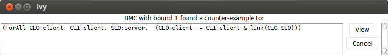

IVy tried the conjecture that node client is connected to any server
for one step and found it false. If we click `View`, here is what we see:

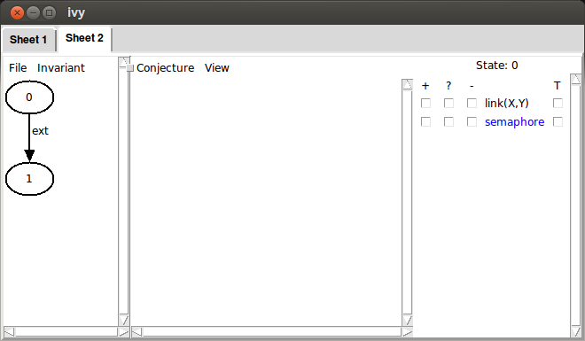

IVy has created a new tab in the interface with a trace consisting of
two steps. The arrow represents a transition from state `0` to state
`1` using the `ext` action. This represents an action of the environment.
Clicking on state `0`, and checking the `link` and `semaphore` relations,
we see the following:

That is, in the initial state there are two clients and one server, the
semaphore of the server is up and there are no links.

Now, clicking on state `1`, we see our proposed bad pattern. This
means that the pattern can actually occur.

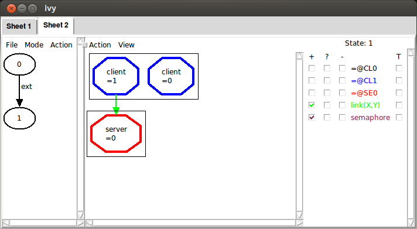

# Debugging

To see details of the execution path, we left-click on the action
`ext` and select `Decompose`. This breaks down an action into smaller
actions. In this case, we see that the environment has decided to call
the exported action `connect`:

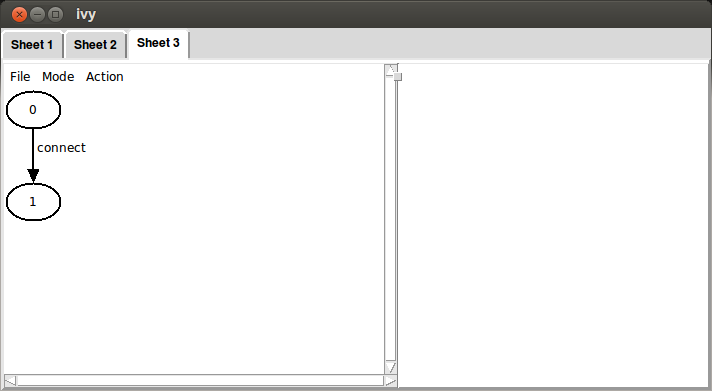

Applying `Decompose` to this action we see:

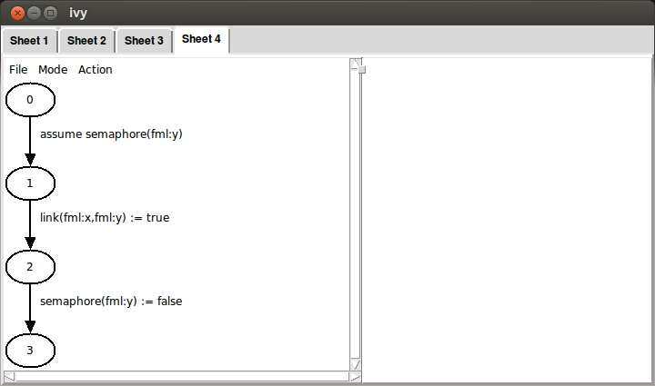

This shows us that `connect` is made up of a sequence of three smaller
actions. If we left-click on one of these and choose `Show source`,
the corresponding source line is display. By single-clicking on a state,
we can display it graphically:

This is state 2, which is after the link is created, but before the
semaphore is lowered. The two identifiers `fml:x` and `fml:y` represent
the formal parameters of action `connect`. We can see which client is `x`
at this point in the code by checking the `+` box for `fml:x`:

As we decompose actions, we build up a sequence of tabs,
corresponding to something like a stack trace of the program's
execution. Tabs can be removed by choosing `Remove tab` from the
`File menu`.

Whenever you see a counterexample to induction or a bounded checking
counterexample, you can decompose the actions to see the execution
path that led to the failure.

# Removing a failed conjecture

Even with bounded checking, it is still possible that we could mistakenly
strengthen the invariant with a conjecture that isn't true. If this happens,
or if we regret a conjecture for any other reason, we can remove it using
the `Weaken` operation in the `Invariant` menu:

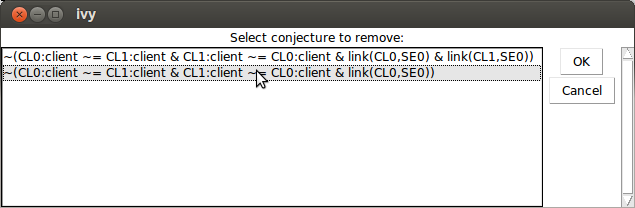

This dialog can be resized to see long formulas. 

# Summary

To debug an inductive invariant, we generate *counterexamples to induction* using the
`Check induction` operation. IVy tries to generate the simplest possible counterexample.

A CTI can be eliminated by strengthening the proposed inductive invariant. To do this,
we identify a bad pattern in the CTI. This is done in the following steps:

- Use the check boxes to display relevant information
- `Gather` the displayed facts
- Select relevant facts by clicking to enable or disable them.
- `Strengthen` the invariant by generalizing the bad pattern.

You can get some help from IVy in this process:

- Use `Bounded check` to see if the bad pattern is reachable in a given number of steps.
- Use `Minimize` to generalize the pattern by dropping un-needed facts.

To debug a counterexample, left-click on an action and choose
`Decompose`. The `View source` operation can be used to find the
action in the source file.

When you are convinced that a bad pattern should be ruled out, use `Strengthen` to
generalize it to a universal conjecture and add it to the proposed invariant.
To remove a conjecture from the proposed invariant, use `Weaken`.

When `Check induction` produces no CTI, the conjectured invariant is
in fact a safety invariant. You can save it for future use with the
`Save invariant` operation.

