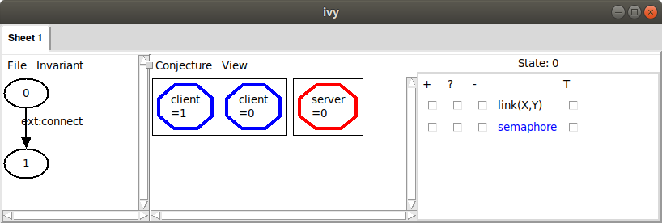
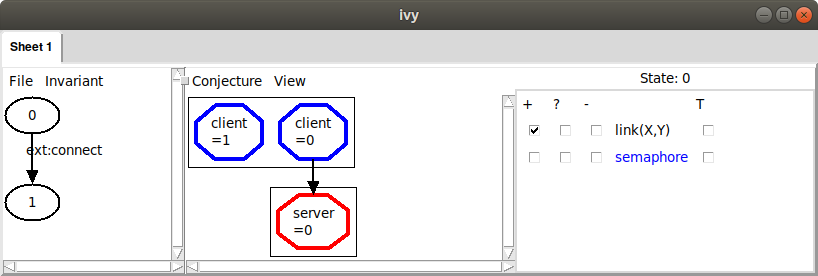
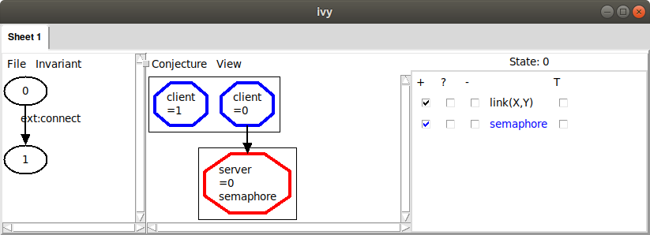
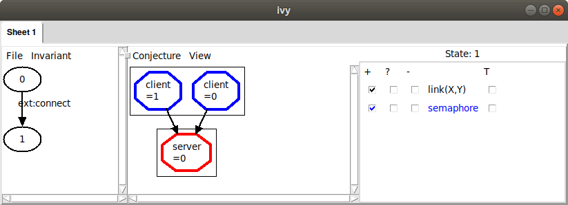

In this tutorial, we'll learn how to make an abstract model of a
simple protocol and prove a property of it using an *inductive
invariant*. This is usually the first step in designing and
implementing a protocol in Ivy. 

An invariant of a system is a formula about the system's state that is
always true.  Invariants are the simplest class of properties that we
specify about systems. An *inductive* invariant is a formula or a set
of formulas that has the following key properties:

- *initiation*: It is true in all initial states of the program.

- *consecution*: If it is true in a state, then after executing any
exported action, the formula remains true.

Every inductive invariant is an invariant, but not every invariant is
inductive. An inductive invariant is relatively easy to prove,
since we only have to verify the iniation and consecution property, a task which
Ivy can usually perform automatically. Usually, though, the invariant properties we
really want to prove are not inductive and we therefore require some cleverness
to *strengthen* the desired invariant to make it inductive.

As we will see, IVy makes this step easier by providing tools to
visualize the failures of inductive proofs and suggest possible
refinements to the proof.

# An abstract protocol model

The following Ivy program is a very abstract model of a protocol that establishes
connections between clients and servers. Each server has a semaphore
that is used to guarantee that at any time at most one client can be
connected to the server.

    #lang ivy1.7

    type client
    type server

    relation link(X:client, Y:server)
    relation semaphore(X:server)

    after init {
        semaphore(W) := true;
        link(X,Y) := false
    }

    action connect(x:client,y:server) = {
      require semaphore(y);
      link(x,y) := true;
      semaphore(y) := false
    }

    action disconnect(x:client,y:server) = {
      require link(x,y);
      link(x,y) := false;
      semaphore(y) := true
    }

    export connect
    export disconnect

This program declares two *types* `client` and `server`. At this
point, we don't know anything about these types except that there is
at least one value of each type. The types `client` and `server` can
be though of as represent abstract identifiers of clients and servers,
respectively.

The *state* of the protocol model consists of two *relations*. The
relation `link` tells us which clients are connected to which servers,
while `semaphore` tells us which servers have their semaphore "up".

The program contains a block code after the keywords `after
init`. This code is executed just once when the protocol starts. It
initializes the state so that all the semaphore are "up" (that is, for
every server `W`. `semaphore(W)` is set to true) and there are no
links (that is, for every client `X` and server `Y`, `link(X,Y)` is
set to false). These statements are simultaneous assignments that
update the given relations for many values of their parameters at
once. The state of the protocol model consists of two relations. The
relation `link` tells us which clients are connected to which servers,
while `semaphore` tells us which servers have their semaphore "up".
You can recognize a simultaneous assignment by the fact that the
parameters of the relations are placeholders (or wildcards)
represented by capital letters.

The program exports two actions to the environment: `connect` and
`disconnect`. The `connect` actions creates a link from client `x` to
server `y`, putting the server's semaphore down. Each action has a
*precondition*, indicated by the `require` keyword. To call an action,
the environment is required to satisfy its precondition. Notice that
`connect` requires that the server's semaphore be initially up. The
`disconnect` action removes a link and puts the semaphore up. It
requires that the link be initially established. The two `export`
declarations at the end tell us that the environment may call
`connect` and `disconnect` in arbitrary sequence, though it must obey
the stated requirements.

It is important to keep in mind that this Ivy program is an abstract
model of a protocol, and not the protocol's actual implementation. The
abstract actions just describe the possible high-level state transitions that
the protocol can make.  It doesn't tell us how these transitions
actually come about.

## Safety and invariant conjectures

Now we will give our abstract model a proeprty that it must satisfy.
A simple one is to add an *invariant*. This is a formula that must
hold true between calls by the environment to the program's actions
(though it might be untrue temporarily while the actions are
executing). In the client/server example above, we might specify that
no two distinct clients can be connected to a single server at the same time.
We can express this property using the
following invariant assertion:

    invariant ~(X ~= Z & link(X,Y) & link(Z,Y))

Once again the capital letters act as wildcards. The invariant
assertion implicitly holds true for all clients `X` and `Z` and all
servers `Y`. Another way to say this is that the placeholders `X`, `Y`
and `Z` are implicitly *universally quantified*. 

# Proving the invariant

As mentioned above, to prove an invariant, we check that is initially true,
and that every action of the program preserves it. Ivy can do this automatically.
To make the check, we use this command:

    $ ivy_check client_server_example.ivy
    
[Note: the source files for the examples in this tutorial can be found in the
subdirectory `doc/examples` if the Ivy source tree]. Ivy attempts the check and produces
this somewhat discouraging output (with uninteresting parts omitted):

    ...
    
    Initialization must establish the invariant
        client_server_example_new1.ivy: line 30: invar2 ... PASS
    
    ...

    The following set of external actions must preserve the invariant:
        ext:connect
            client_server_example_new1.ivy: line 30: invar2 ... FAIL
        ext:disconnect
            client_server_example_new1.ivy: line 30: invar2 ... PASS

    ...

    error: failed checks: 1

This means that our proposed invariant may be true, but it isn't
inductive. In particular the `connect` action doesn't preserve the
invariant.  We should take heart, however, because Ivy can give us
some feedback that explains what went wrong in the form of a
*counterexample*.  A counterexample in this case is an execution of
the `connect` action that starts in a state in which the invariant is
true and ends in a state in which it is false.

We can get a graphical view of the counterexample by running the check again with the
option `diagnose=true`, like this:

    $ ivy_check diagnose=true client_server_example.ivy

Ivy pops up a window that looks like this:

In the left pane of this window is a diagram in which each oval
represents a state of the protocol and each arrow represents the
execution of an action. There are two states, labeled 0 and 1. From
state 0 to state 1 there is an arrow labeled with the action
`connect`. We know something has gone wrong in the execution of `connect`. 

In the left pane, we see a graphical representation of
state 0. Currently, all we see is that there are two clients (in other
words, two values of type `client`) and there is one server. To learn
more about the state, we can use the checkboxes on the right to enable
the display of relations in this state. For example, if we check the
box in the `+` column next to the relation `link(X,Y)`, we'll see an
arrow from client `X` to server `Y` when the relation `link(X,Y)` is
true. In this case, we see:

Here, we see that just one client is connected to the server, which means our
invariant property is true. When we check that an invariant is inductive, the counterexample
always starts in a state in which the invariant holds. If we check the box in the `+` column next to `sempahore(X)`, we can begin to see a problem:

Ivy is telling us that the value of `semaphore` at our server is
true. We had in mind, however, that the semaphore should be "down"
(i.e., false) whenever a client is connected to the server. We
therefore suspect that this state of the system is not possible (that
is, it is not *reachable* from the initial state). This usually means
that we need to add another formula to our invariant to rule out
something bad about this state.

To see the consequence of the semaphore being up, we can move to state
one by clicking on it. Here's what we see:

Now both clients are linked to the same server, violating our
invariant property. A counterexample to induction always ends in this
way. To see more detail about how we got there, we can left-click on
the action `connect` and choose `Step in`. This will show us the
detailed sequence of actions that got to the bad state:

Here, we are viewing state 0 (the state that occurs just at entry to
the `connect` action). We have checked a few boxes to display
information about this state. We can see here the values of the formal
parameters `x` and `y` that were provided by the environment when
calling `connect`. In particular, the environment chose the value 1
for `x`, meaning that clent `1` should be connected to server 0 (the
only server in this case). The counterexample steps through three additional
states, first testing the precondition of `connect` (which is true, since the semaphoore is up),
then establishing a link from `x` to `y`, then putting the semaphore down.

At this point we understand the reason that the invariant is not inductive.
The failure was caused by the fact that a client `X` was connected to a server `Y`
and the semaphore at this server was up. This *bad pattern* caused the failure, 
and we conjecture that it can never actually occur. For this reason, we will *strengthen*
our invariant with a condition that rules out the bad pattern. It is very important to
understand that we do not want to rule out *everything* about the counterexample that is unrealistic -- only those aspects that actually *cause* the failure. 

To rule out the bad pattern, we add this new conjectured invariant to our Ivy program:

    private {
        invariant ~(link(X,Y) & semaphore(Y))
    }
    
This says that there is *no* client `X` and server `Y` such that `X`
is linked to `Y` and the semaphore at `Y` is up. Notice again that the
capital letters `X` and `Y` are universally quantified placeholders.
We put the new invariant property in a `private` section just to
indicate that this invariant is not of interest to users of the
protocol model. It is only introduced as part of the proof of the
original invariant. Now when we check the program, we get this:

    ...

    Initialization must establish the invariant
        client_server_example_new.ivy: line 26: invar2 ... PASS
        client_server_example_new.ivy: line 34: invar3 ... PASS

    Any assertions in initializers must be checked ... PASS

    The following set of external actions must preserve the invariant:
        ext:connect
            client_server_example_new.ivy: line 26: invar2 ... PASS
            client_server_example_new.ivy: line 34: invar3 ... PASS
        ext:disconnect
            client_server_example_new.ivy: line 26: invar2 ... PASS
            client_server_example_new.ivy: line 34: invar3 ... PASS

    ...
    OK
    
The OK at the end tells us that our invariants taken together are now
inductive. This means we can be confident that the invariants always
hold. 

Another way to create a conjectured invariant from a bad pattern is to
have Ivy to gather the displayed facts and generalize them. Once we
have the bad pattern displayed, as above, we use the 'Gather' command
in the `Conjecture` menu. This gives us the following:

IVy has collected three facts about the displayed state, shown under the
heading 'Constraints'. These facts are a logical representation of the
bad pattern we observed graphically: there are two distinct nodes,
one of which is connected to the server and the server's semaphore is up.

Also notice that the nodes and the arcs in the graph have been highlighted
to indicate that they are all used in the listed facts. We can click on facts
in th list to toggle them off and on. This allows us to adjust the bad pattern.

Since we think that the displayed facts form a bad pattern, we can *generalize* them
to produce a new conjectured invariant about the program
state. Choosing the `Strengthen` option from the `Conjecture` menu, we
see:

IVy is suggesting to add this fact to the list of conjectured invariants:

    ~(C:client ~= D & link(C,S) & semaphore(S))

Ivy has simply replaced the fixed client and sever identifiers in the
gathered facts with universally quantified placeholders `C`, `D` and
`S`.  This formula says that we cannot have two distinct clients,
where one of them is linked to the server and the semaphore is up. We
click OK, adding this formula to our list of conjectured invariants.

We can now try checking inductiveness again with our new conjecture.
We do this with the `Check induction` command in the `Invariant` menu.
We see the following:

If the induction check had failed, we sould see a new counterexample
to induction that we would have to rule out.  However, since it was
successful, we now have a proof that our desired invariant holds. Of
course, we want to save our new inductive invariant so that we can use it again
later. We select `Save invariant` from the `File` menu and enter a
file name:

Here is the content of the file:

    # new conjectures

    invariant ~(C:client ~= D & link(C,S) & semaphore(S))

This new invariant can be pasted into our program. Notice it is
slightly different from the invariant we selected previously. That
is, the bad pattern includes a second client `D` that is needed to
violate the desired property of mutual exclusion. I turns out this
doesn't matter. This weaker invariant is still strong enough to prove
the property. 

Let's consider the process we just used to arrive at an inductive
invariant. We took the following steps:

- Find a simple counterexample to induction

- Identify relevant facts about the counter-example (the bad pattern)

- Generalize to form a universally quantified invariant conjecture

The first and last steps were done automatically by IVy. However, we
performed the second step manually, by select which relations to
display. 

This process is something of an art and can be
confusing.  For example, it sometimes happens that a condition we
thought was a bad pattern is actually reachable. In this case, we have
to backtrack and perhaps rule out a more specific
pattern. Fortunately, Ivy provides some tools to help us make these
choices.

# Generalization tools

Ivy has some techniques built in to help us identify bad patterns.
Let's to back to the counterexample we found to inductiveness of our
proposed invariant:

We can ask Ivy to try to generalize from the counterexample, by finding
a ba pattern in state 0 that is sufficient to cause our proposed
invariant to fail at state 1. To do this we choose `Diagram` from the `Invariant` menu.
This produces the following display:

Ivy has drawn a diagram of a possible bad pattern it has identified
in the state.  The pattern includes the two clients and the server
from our counterexample, which are highlighted in the diagram.  In
addition, it includes the link from client 1 to the server, and the
fact that the semaphore is true at the server. These facts are listed
below the diagram under the heading 'Constraints'. Ivy has determined
that these conditions are sufficient to cause the invariant to
fail. 

Since we agree that this is a bad pattern, we can use the `Strengthen`
option from the `Conjecture` menu, as above, to produce a conjectured
invariant the rules it out. In this simple case, the strenghening of
the invariant has been done fully automatically.

However, as we noted above, this bad pattern contains in irrelevant
fact, and we might want to drop it to get a stronger conjecture that
rules out more cases. That is, our bad pattern requires that there are
two distinct nodes, `0` and `1`. In fact, we do need two nodes to have
a safety violation (that is, to have two nodes connected to one
server). Notice, though, that if we drop this fact from the pattern,
we still have a pattern that we can rule out, that is, `semaphore(0)`
and `link(0,0)`.

To check this idea, we remove the irrelevant fact from the pattern by clicking on it.
The unwanted fact becomes gray:

When we strengthen using this pattern, we get this:

That is, our new conjecture says that no client can be connected to a
server with the semaphore up, but it doesn't depend on the existence
of any other client. We can verify that with this conjecture, we still
have an inductive invariant.

This illustrates an important point about inductive invariants: there
are many of them.  This give us the flexibility to find a simple one.
By dropping a fact from the bad pattern, we effectively generalized
it.  That is, we ruled out a larger class of states, so in effect we
made a *stronger* conjecture. 

IVy can often discover automatically that a bad pattern can be
simplified.  One way to do this is to use *bounded
reachability*. After `Gather`, Instead of manually eliminating the
unwanted facts, we can select `Minimize` from the `Conjecture`
menu. IVy ask for the number of steps to check. Somewhat arbitrarily,
we choose four. This is the result we get:

IVy has recognized that there is a more general pattern that can be
ruled out if we consider only four steps of execution of the protocol.
Its conjecture is that if any client is connected to a server, that
server's semaphore is down. This fact is definitely true after four
steps of execution, but it's still a conjecture. If we're suspicious
that it might not be invariantly true, we could try five steps, six
steps, and so on until we are convinced, or until the IVy gets too
slow.

We can add IVY's generalized conjecture to our set using `Strengthen`,
which completes the proof.

# Things that go wrong

At some point, we will make a conjecture that is just plain wrong, in
the sense that it is not always true. Before clicking `Strengthen`, it's a good
idea to try `Bounded check` to see if the proposed bad pattern can actually
occur within some fixed number of steps. 

To see how this goes, suppose we get into this situation:

Here, we didn't consider the semaphore and we conjectured a bad
pattern in which there is a client connected to a server. Obviously
(or hopefully) this is actually reachable. To see why this is a bad conjecture,
we can select `Bounded check` from the `Conjecture` menu. Here's what we see when we choose
one step:

IVy tried the conjecture that node client is connected to any server
for one step and found it false. If we click `View`, here is what we see:

IVy has created a new tab in the interface with a trace consisting of
two steps. The arrow represents a transition from state `0` to state
`1` using the `ext` action. This represents an action of the environment.
Clicking on state `0`, and checking the `link` and `semaphore` relations,
we see the following:

That is, in the initial state there are two clients and one server, the
semaphore of the server is up and there are no links.

Now, clicking on state `1`, we see our proposed bad pattern. This
means that the pattern can actually occur.

# Debugging

To see details of the execution path, we left-click on the action
`ext` and select `Decompose`. This breaks down an action into smaller
actions. In this case, we see that the environment has decided to call
the exported action `connect`:

Applying `Decompose` to this action we see:

This shows us that `connect` is made up of a sequence of three smaller
actions. If we left-click on one of these and choose `Show source`,
the corresponding source line is display. By single-clicking on a state,
we can display it graphically:

This is state 2, which is after the link is created, but before the
semaphore is lowered. The two identifiers `fml:x` and `fml:y` represent
the formal parameters of action `connect`. We can see which client is `x`
at this point in the code by checking the `+` box for `fml:x`:

As we decompose actions, we build up a sequence of tabs,
corresponding to something like a stack trace of the program's
execution. Tabs can be removed by choosing `Remove tab` from the
`File menu`.

Whenever you see a counterexample to induction or a bounded checking
counterexample, you can decompose the actions to see the execution
path that led to the failure.

# Removing a failed conjecture

Even with bounded checking, it is still possible that we could mistakenly
strengthen the invariant with a conjecture that isn't true. If this happens,
or if we regret a conjecture for any other reason, we can remove it using
the `Weaken` operation in the `Invariant` menu:

This dialog can be resized to see long formulas. 

# Summary

To debug an inductive invariant, we generate *counterexamples to induction* using the
`Check induction` operation. IVy tries to generate the simplest possible counterexample.

A CTI can be eliminated by strengthening the proposed inductive invariant. To do this,
we identify a bad pattern in the CTI. This is done in the following steps:

- Use the check boxes to display relevant information
- `Gather` the displayed facts
- Select relevant facts by clicking to enable or disable them.
- `Strengthen` the invariant by generalizing the bad pattern.

You can get some help from IVy in this process:

- Use `Bounded check` to see if the bad pattern is reachable in a given number of steps.
- Use `Minimize` to generalize the pattern by dropping un-needed facts.

To debug a counterexample, left-click on an action and choose
`Decompose`. The `View source` operation can be used to find the
action in the source file.

When you are convinced that a bad pattern should be ruled out, use `Strengthen` to
generalize it to a universal conjecture and add it to the proposed invariant.
To remove a conjecture from the proposed invariant, use `Weaken`.

When `Check induction` produces no CTI, the conjectured invariant is
in fact a safety invariant. You can save it for future use with the
`Save invariant` operation.

