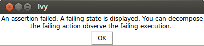
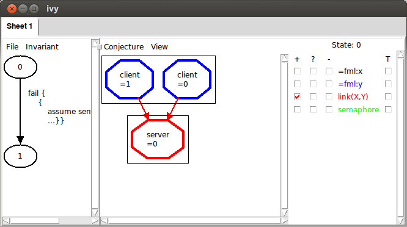
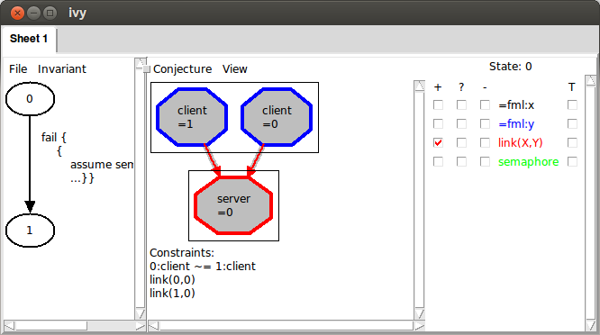

The most basic technique for proving correctness in IVy is to
construct an inductive invariant. IVy makes this easier by providing
tools to visualize the failures of inductive proofs and suggest
possible refinements to the proof.

An *safety invariant* is a formula or a set of formulas that has the
following properties:

- *initiation*: It is true in all initial states of the program.

- *safety*: If it is true in a program state, then no exported action
can cause an assertion failure starting in that state.

- *consecution*: If it is true in a state, then after executing any
exported action, the formula remains true.

In this example, we will use IVy's CTI method. CTI stands for
"counter-example to induction". If one of the above conditions fails,
IVy tries to construct a *simple* example of the failure. We can
attempt to correct the proof by *generalizing* from this
counter-example.

# An abstract protocol model

The following is a very abstract model of a protocol that establishes
connections between clients and servers. Each server has a semaphore
that is used to guarantee that at any time at most one client can be
connected to the server.

    #lang ivy1.5

    type client
    type server

    relation link(X:client, Y:server)
    relation semaphore(X:server)

    init semaphore(W) & ~link(X,Y)

    action connect(x:client,y:server) = {
      assume semaphore(y);
      link(x,y) := true;
      semaphore(y) := false
    }

    action disconnect(x:client,y:server) = {
      assume link(x,y);
      link(x,y) := false;
      semaphore(y) := true
    }

    export connect
    export disconnect

This program declares two types `client` and `server`. The state of
the protocol model consists of two relations. The relation `link`
tells us which clients are connected to which servers, while
`semaphore` tells us which servers have their semaphore "up".

The program exports two actions to the environment: `connect` and
`disconnect`. The `connect` actions creates a link from client `x` to
server `y`, putting the server's semaphore down. Notice that `connect`
assumes the server's semaphore is initially up. The `disconnect`
action removes a link and puts the semaphore up. The two `export`
declarations at the end tell us that the environment may call
`connect` and `disconnect` in arbitrary sequence, though it must obey
the stated assumptions.

## Safety and invariant conjectures

A program is *safe* if the environment cannot call it in any way that
causes an assertion to be false. There are various way to use
assertions to specify desired safety properties of a program. A simple
one is to add a test action that asserts some property of the program
state. In the client/server example above, we might specify that no
two distinct clients can be connected to a single server using the
following test action:

    action test = {
      assert ~(X ~= Z & link(X,Y) & link(Z,Y))
    }

    export test

The assertion is implicitly universally quantified over (distinct)
clients `X` and `Z` and server `Y`. 

# Discovering a safety invariant

To try to construct a safety invariant for this program, we run IVy in
its CTI mode. Here is the command line:

    $ ivy ui=cti client_server_example.ivy

This produces the following rather uninformative display:

Since we didn't specify any conjectured invariant formulas in the
input file, IVy starts with the empty set of conjectures. This
trivially satisfies the initiation and consecution conditions, but
probably won't satisfy the saftey condition. We'll try anyway and see
what goes wrong. We select the "check inductiveness" operation, like this:

Here's what IVY says:

When we click OK, we see the following display:

On the left-hand side of the display, we see a transition of the
program from a state labeled `0` to a state labeled `1`. The action
labeling the transition arrow can tell us seomthing about hwo we get
from state `0` to state `1` (an in particular, how the assertion in
our program fails). For the moment, though, let's concentrate on the
right-hand side. Here, we see a representation of state `0`, the one just
before the asertion failure. It shows one server (arbitrarily numbered `0`)
and two clients (numbered `0` and `1`). The checkboxes on the right allow us to
display further information about the state. For example, let's check the box
next to `link(X,Y)` under the label `+`. Here's what we get:

The red arrows show the link relationships between the clients and the
server (notice that on the right, the relation `link(X,Y)` is in red).
This is condition that causes our assertion to fail when the `test`
action is executed. 

This situation is unrealistic. That is, a cluster of two clients and a
server as shown should never occur. We will conjecture that in fact
thsi 'bad pattern' never occurs. To do this we select the `Gather` option
from the `Conjecture` menu. When then see the following:

IVy has collect three facts about the displayed state, shown under the
heading 'Constraints'. These facts are a logical representation of the
bad pattern we observed graphically. Two of them are obvious: the facts
`link(0,0)` and `link(1,0)` say that both clients are linked to the server.
Implicit in the grpahic, though, is a third fact: `0:client ~= 1:client`. 
This says that `0` and `1` name distinct clients. 

Also notice that the nodes and the arcs in the graph have been highlighted
to indicate that they are all used in the listed facts.

Since think that this particular pattern should never occur, we will generalize
it to produce a *conjecture* about the program state. Choosing the `Strengthen` option
from the `Conjecture` menu, we see:

IVy is suggesting to add this fact to the list of conjectured invariants:

    ForAll CL0:client, CL1:client, SE0:server. ~(link(CL0,SE0) & link(CL1,SE0) & CL0 ~= CL1

This says that there is are no clients `CL0` and `CL1` and server
`SE0` matching our bad pattern.  In other words, the bad pattern
occurrs nowhere in our program state, no matter how many clients and
servers there are. This is a simple generalization from our
counterexample.

We click OK, adding this formula to our (thus far empty) list of
conjectures.  Of course this conjecture is a trivial one. It just says
that the formula in our assertion is always true.

We can now try checking inductiveness again with our new conjecture.
Here is what IVy says:

It is telling us that our new conjecture fails the consecution test.
When we click OK, we see the counter-example to induction:

IVy has already displayed the `link` relation, since it occurs in the
conjecture.

