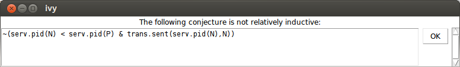
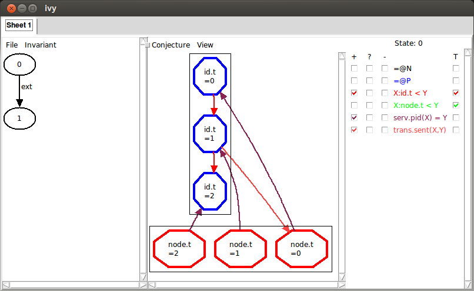
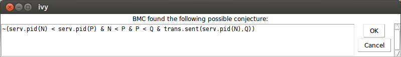
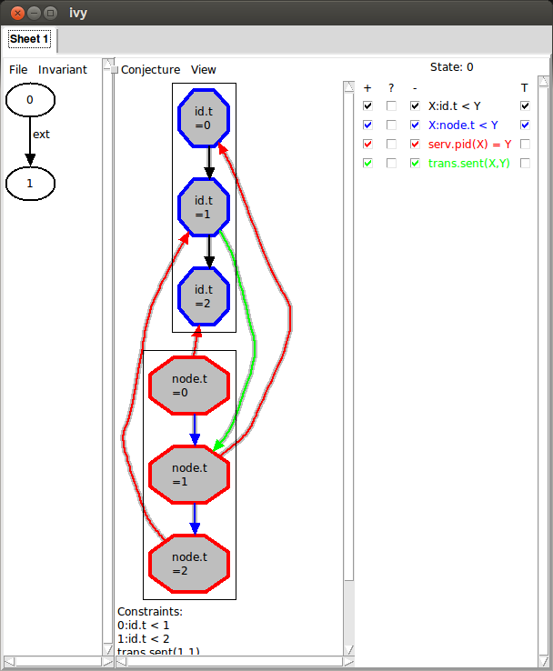
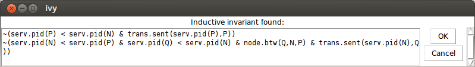

Many systems are designed to include an arbitrary number of similar or
identical components. A good example of such a system is the Internet,
which is designed to accommodate a large number of hosts, all
communicating using the same set of protocols. Another example would
be peer-to-peer protocols such as
[Chord](https://en.wikipedia.org/wiki/Chord_(peer-to-peer)).

We call these *parameterized systems* where the parameter in question
is the number of protocol participants. Ivy allows you to model an
implement parameterized protocol in a particular style. A
*parameterized* object is one in which every component has an initial
parameter of the same type. Here is an example of an object parameterized on type `t`:

    type t

    object foo = {

        function bit(S:t) : bool
        after init {
            bit(S) := false
        }

        action set_bit(self:t) = {
            bit(self) := true
        }
    }

Notice that both the state component `bit` and the action `set_bit`
have a first parameter of type `t`. The parameter of `set_bit` is
suggestively called `self`. This parameter is used in any references
to state components within the action. Thus, object `foo` really acts
like a collection of independent objects or processes, one for each
element of type `t`. The type `t` acts like a reference to one of
these objects. 

Ivy provides a shorthand for parameterized objects. We can equivalently
write the object `foo` as follows:

    type t

    object foo(self:t) = {

        individual bit : bool
        after init {
            bit := false
        }

        action set_bit = {
            bit := true
        }
    }

Ivy adds the parameter `self` to each state component of `foo`, and
each reference to a component. That is, `self` becomes an implicit
parameter, much as it does in an object-oriented programming language
(except for Python, where the `self` parameter is explicit). It makes
no difference to Ivy whether you use implicit or explicit
parameters. You can reason about Ivy programs in the same way using
either style.

As we will see later, IVY has special support for parameterized
objects.  For example, you can compile them and run them in separate
process spaces or on different hosts. In addition, when proving
assertions that relate to only one process, you can ignore the
parameter. This can be a good trick for staying within a decidable
logical fragment.

### Leader election ring

As an example of a parameterized protocol, lets look at the very
simple leader election protocol, introduced in [this paper](http://dl.acm.org/citation.cfm?id=359108) in
1979.

In this protocol we have a collection of distributed processes
organized in a ring. Each process can send messages to its right
neighbor in the ring and receive message from left neighbor. A process
has a unique `id` drawn from some totally ordered set (say, the
integers). The purpose of the protocol is to discover which process
has the highest `id` value. This process is elected as the "leader".

This protocol itself is trivially simple. Each process transmits its
own `id` value. When it receives a value, it retransmits the value,
but only if it is *greater than* the process' own `id` value. If a
process receives its own `id`, this value must have traveled all the
way around the ring, so the process knows its `id` is greater than all
others and it declares itself leader.

We'll start with a service specification for this protocol, using the
explicit parameterized style:

    isolate app = {

        action tick(me:node)                 # called when a timer expires
        action elect(me:node)                 # called when v is elected leader

        specification {
            before elect {
                ensure me.pid >= node.pid(X)    # only the max pid can be elected
            }
        }
    } with node, id, trans

The isolate `app` is parameterized on an abstract datatype `node`
that we will define shortly. Type `node` represents a reference to a
process in our system. The function `pid` gives the `id` of a node, and
will be defined shortly. The `with` clause at the end of the isolate
tells us that this isolate depends on isolates `node`, `id` and `trans`
that we will define later.

The interface of `app` has two actions: `tick` is called by the
environment at some frequency, while `elect` is called by a node when
it is elected leader.  The specification of `elect` says that only the
node with the maximum `id` value can be elected.

Now that we know what the protocol is supposed to do, let's implement it:

    isolate app = {

        ... 

        implementation {
            implement tick(me:node) {
                call trans.send(me,me.get_next,me.pid);
            }

            implement trans.recv(me:node,v:id) {
                if v = me.pid {  # Found a leader
                    call elect(me);
                }
                else if v > me.pid  { # pass message to next node
                    call trans.send(me,me.get_next,v);
                }
            }
        }
    } with node, id, trans

We implement the `tick` by calling the network transport `trans` to
send our `id` to the next node in the ring.
The protocol also implements the `recv` action of the transport interface.
This is called when the process receives a message with
an `id` value `v`. If the value is equal to the process' own `id`, the
process knows it is leader and calls `elect`. Otherwise, if the
received value is greater, it calls `trans.send` to send the value on
to the next node.

Here is the same isolate described in the implicit style:

    isolate app(me:node) = {

        action tick                 # called when a timer expires
        action elect                 # called when v is elected leader

        specification {
            before elect {
                ensure me.pid >= node.pid(X)    # only the max pid can be elected
            }
        }

        implementation {
            implement tick {
                call trans.send(me,me.get_next,me.pid);
            }

            implement trans.recv(v:id) {
                if v = me.pid {  # Found a leader
                    call elect;
                }
                else if v > me.pid  { # pass message to next node
                    call trans.send(me,me.get_next,v);
                }
            }
        }
    }

There is not much difference. Notice that we dropped the parameter
`me` from the action definitions. However, references to other objects
still have to have the explicit parameter `me`. The implicit style
mainly shows an advantage when the parameterized object has many references
to its own actions and state components.

With our protocol implemented, let's look at the interfaces that it's
built on, starting with the type of `id` values:

    module total_order_properties(t) = {
        property [transitivity] X:t < Y & Y < Z -> X < Z
        property [antisymmetry] ~(X:t < Y & Y < X)
        property [totality] X:t < Y | X = Y | Y < X
    }

    isolate id = {
        type this

        specification {
            instantiate total_order_properties(this)
        }
    }

We defined a module that captures the properties of a total order,
since we will re-use these for two different types. In fact, this
module can also be found in the standard library `order`.  We then
define our abstract type `id` to be a type that satisfies these
properties.  Later, we will implement type `id` with fixed-width
integers.

Now let's look at the type of nodes, which is a bit more
interesting:

    isolate node = {
        type this
        action get_next(x:this) returns (y:this)
        function pid(X:node) : id          # map each node to an id

        axiom [injectivity] pid(X) = pid(Y) -> X = Y

        specification {

            instantiate total_order_properties(this)   

            after get_next {
                ensure (x < y & ~ (x < Z & Z < y)) | (y <= X & X <= x)
            }
        }
    }

The type `node` supplies an action `get_next` that takes an element `x` and
returns the next element `y` in the ring.  The specification says that
either `y` is the least element larger than `x` or `x` is the maximum
element and `y` the minimum (that is, we "wrap around" to the
beginning). In principle, we should also say that the type `node` is finite,
but we won't actually need this fact to prove safety of our protocol.
This is one way of specifying a ring topology. Later we will
see a different way that can make the proofs a little simpler. We can
implement either version with fixed-width integers. We omit the implementation
here.

Notice the axiom `injectivity`. This says that no two processes have
the same `id`, which is necessary for correctness of the protocol. It
is an axiom rather than a property because it is an assumption about
the envionment. That is, we *assume* that the processes are configured
such that each has a unique `id` but we cannot prove this.

Finally, we need a specification for the network transport layer. It's
quite simple:

    isolate trans = {

        action send(src:node, dst:node, v:id)
        action recv(dst:node, v:id)

        specification {
            relation sent(V:id, N:node) # The identity V is sent at node N

            after init {
                sent(V, N) := false;
            }

        before send {
            sent(v,dst) := true
        }

        before recv {
            require sent(v,dst)
        }
    }

The relation `sent` tells us which values have been sent to which
nodes.  Initially, nothing has been sent. The interface provides two
actions `send` and `recv` which are called, respectively, when a value
is sent or received. The `src` and `dst` parameters give the source
and destination node of the message.

The specification says that a value is marked as sent when `send`
occurs and a value must be marked sent before it can be received.
This describes a network service that can duplicate or re-order
messages, but cannot corrupt messages.

Notice that `trans` has been written as paramterized isolate. In
particular, the first parameter of each action is the *location* where
the action occurs (the source for `send` and the destination for
`recv`). This is imporant for extracting parallel processes from the
Ivy code. In the [netorking tutorial](http://microsoft.github.io/ivy/examples/networking.html)
we will see how the transport service can be implemented.

## Verifying the leader election protocol

Now let's try to verify that the implementation of our leader election
protocol `app` satisfies its service specification, assuming the
specifications of `trans`, `node`, `id`. 

We are trying to prove that, when any node calls `app.elect`, it in
fact has the highest `id`. That is, the `ensure` statement is a
guarantee of `app` when it calls `app.elect`.

Obviously, we will need an inductive invariant at this point. We will
try to discover one using Ivy's [CTI
method](client_server_example.html).  You can find this example
in the Ivy source directory `doc/examples`. We start Ivy using this command:

    $ ivy_check isolate=app diagnose=true leader_election_ring.ivy

Ivy finds a counterexample to the `ensure` statement, and starts the
graphical interface (because we used `diagnose=true`). 

This is what we see:

On the left, we see a failing transition starting in state `0`. The
transition to state `1` is a failing call to `trans.recv`.  To see the
execution in more detail, we can
left-click on the transition and choose `Step in`.  In this case,
however, we already have a pretty good idea of what went wrong: some
node must have received its own `id` and declared itself leader
without having the highest `id`. This is not surprising, since with no
invariant conjectures, the only thing we know about state `0` is that
it satisfies our axioms.

On the right, we see a depiction of the state `0`. There are two
elements in each of the two sorts `id.t` and `node.t`. Since we
haven't yet selected any relations to view, this is all we see. We
could start selecting relations to see more information, but let's
instead choose the command `Invariant|Diagram` to see what information
Ivy thinks might be relevant to the failure. Here's what we see:

The arrow from id 0 to id 1 is depicting the relation `X:id.t < Y`.
Because the arrow goes from `X` to `Y`, we interpret the arrow to mean
`0:id.t < 1`.  Similarly, the arrow from node 0 to id 0 means that
`asgn.pid(0) = 0`.  That is, the id of node 0 is 0. We can also see
that node 1's id is 1 and that `trans.sent(0,1)`, in other words, id 0
has been sent to node 0. These facts are displayed below the graph
under the heading "Constraints".

The problem is clear: node 1 is receiving its own id, so it is about
to become leader, but it does not have highest id. This situation
clearly has to be ruled out. We do this by selecting the
`Conjecture|Strengthen` command. Here is what Ivy says:

In other words, we conjecture that it never happens that a node N has
id less than a node P, and node N is receiving its own id. Now we choose
`Invariant|Check induction`, to see if our conjecture is inductive. 
Of course, it isn't. Here's what Ivy says:

And here is the counterexample to induction:

Here, some externally called action transitions from state `0`
satisfying our conjecture to state `1` *not* satisfying the
conjecture. Ivy is depicting state `0`, with all the relations that
appear in the conjecture. It's not immediately clear what's wrong here,
so let's try `Invariant|Diagram` again to see what Ivy thinks:

Now we can see the problem: node 2's id is arriving at node 1, but it
should never have passed node 0, because node 0 has a higher
id. Notice, though, that there are two additional arrows in the diagram
we didn't mention (the ones from node 1 to id 0 and id 0 to id 1). Maybe
these are actually irrelevant. We could remove these manually by
clicking on the corresponding facts below. However, we have another
trick up our sleeve. We can use bounded checking to see if some arrows
can be removed. We choose `Conjecture|Minimize` and (somewhat
arbitrarily) select a bound of 4 steps. Here is what Ivy says:

This conjecture says that we never have nodes in the order `N < P < Q`
such that `Q` has a smaller id than `N` and the id of `Q` is arriving
at `P`. In the graph, we see that the highlights have been removed
from the two irrelevant arrows:

Ivy discovered that, within 4 steps, we
can rule out the highlighted facts. By ruling out a more general
situation, we obtain a stronger conjecture. Since this new conjecture
seems right, let's add it to our set by selecting
`Conjecture|Strengthen`.

Now let's try `Invariant|Check induction` again. Ivy is still unhappy
and says that our first conjecture is still not relatively inductive. We
try `Invariant|Diagram` again and here is what we see:

This looks very similar to the diagram that led to our previous
conjecture. Here, however, it's the id of node 0 that is arriving at
node 2, when it couldn't have passed through node 1. This situation is
symmetric to the previous one by rotating the ring. Unfortunately, the
way we described the ring topology using a linear order has broken the
ring's rotational symmetry, so this appears as a distinct case. Later,
we'll see a way to avoid this symmetry breaking. For now, though,
we'll just slog through the cases.  As before, we minimize this
diagram by bounded checking. Here is the result:

Ivy conjectures that we do not have nodes `N < P < Q` such that `N`
has a lower id than `P` and the id of `N` is arriving at `Q`. This is
just another case of the general proposition that a lower id cannot
pass a higher id. We chose `Conjecture|Strengthen` to add this new
conjecture to our set.

Now we try `Invariant|Check induction` (the reader may be able to
guess what happens next). Again, Ivy says that our first conjecture is
not relatively inductive. After `Invariant|Diagram`, we see this:

This describes the same situation, where the id of node 1 is arriving at node 0.
Once again, we generalize using `Conjecture|Minimize`, giving this conjecture:

We add this conjecture using `Conjecture|Strengthen`. Now when we
use `Invariant|Check induction`, we get the following:

That is, we have found a proof for the isolate. We can save this invariant to
a file using the `File|Save invariant` command. We edit these conjectures
into our implementation object `app`, like this:

    isolate app = {

        ...

        private {
            invariant ~(node.pid(N) < node.pid(P) & trans.sent(node.pid(N),N))
            invariant ~(node.pid(Q) < node.pid(N) & trans.sent(node.pid(Q),P) & N < P & P < Q)
            invariant ~(node.pid(N) < node.pid(P) & trans.sent(node.pid(N),Q) & N < P & P < Q)
            invariant ~(node.pid(P) < node.pid(Q) & trans.sent(node.pid(P),N) & N < P & P < Q)
        }
    }

     
## How not to break the rotational symmetry

As we observed above, this proof is a bit messy because of the way we
described the ring topology using a totally ordered set. There's a
different way to describe rings that avoids this problem. Here is an
alternative specification of `node`:

    isolate node = {

        ...

        specification {

            relation btw(X:this,Y:this,Z:this)

            property btw(W, Y, Z) & btw(W, X, Y) -> btw(X, Y, Z)
            property btw(W, X, Z) & btw(X, Y, Z) -> btw(W, X, Y)
            property btw(W, X, Z) & btw(X, Y, Z) -> btw(W, Y, Z)
            property btw(W, Y, Z) & btw(W, X, Y) -> btw(W, X, Z)
            property W = X | btw(W, X, W)
            property ~btw(X, X, Y)
            property ~btw(X, Y, Y)
            property btw(X,Y,Z) |  Y = Z |  btw(X,Z,Y)
            property btw(X,Y,Z) |  Y = X |  btw(Y,X,Z)

            after get_next {
                assert ~btw(x,Z,y)
            }
        }
    }

Instead of putting the nodes in a total order, we define are relation
`btw(X,Y,Z)` that holds when `Y` occurs on the path form `X` to `Z` in
the ring. The axioms of `btw` are a bit more complex than the axioms
of a total order. One the other hand, it is very easy to specify
`get_next` in terms of `btw`. We say that `y` is next after `x` in the
ring if there is no `Z` between `x` and `y`. You might wonder if the
properties given above for `btw` are really correct. Later, when we
implement `node`, we'll prove that it has these properties.

Now, let's try to verify the isolate `app` with this new version of `node`:

    $ ivy_check isolate=app diagnose=true leader_election_ring_btw.ivy

This is what we see:

That is, we have a node `1` that is receiving its own id while node
`0` has a greater id.  Notice, though, that on the right the relation
`node.btw` doesn't appear. This is because it is a ternary relation
and Ivy doesn't know how to display it graphically in a reasonable
way.

Now, as before, let's add this as a conjecture using
`Conjecture|Strengthen`.  As before, `Invariant|Check induction` shows
that this conjecture is not relatively inductive. Applying `Invariant|Diagram`,
this is what we see:

This is similar to what we saw before, but notice the blue arrow from
node `1` to node `0`.  This corresponds to a new relation that has
been added on the right: `node.btw(2,X,Y)`. From this arrow, we can
infer that `node.btw(2,1,0)` holds. That is, starting at `2`, and
moving around the ring, we see `1` before `0`. We can also see this
fact stated below under "Constraints". This means that, from `1`, we
must pass through `0` on the way to `2`. Therefore, the id of `1`
cannot possibly reach `2`, as the diagram shows.

We can try generalizing this diagram using `Conjecture|Minimize`, but
in this case, there is no effect. No matter -- since this looks like a
reasonable conjecture, we use `Conjecture|Strengthen` to add it to our
invariant. Here is the result:

This says it is not possible to have nodes `Q,P,N` in ascending order of id,
such that `P` is on the way from `Q` to `N` and the id of `P` is arriving at `Q`.

Now let's try `Invariant|Check induction`:

Because we haven't broken the rotational symmetry of the ring, there
is just one case needed when we state the key invariant that an id
can't bypass a higher id in the ring. This illustrates that the
complexity of the proof can be affected by how we write the
specification. Once again, we can save this invariant and edit it into
the definition of `app`.

Finally, try this command to verify that in fact the properties of
`btw` are correct for a particular implementation of `node`:

    $ ivy_check leader_election_ring_btw.ivy
    
Have a look at the implementation of the `node` isolate in file
`leader_election_ring_btw.ivy`. If this doesn't make sense, see the
tutorial on
[abstract datatypes](http://microsoft.github.io/ivy/examples/datatypes.html).

