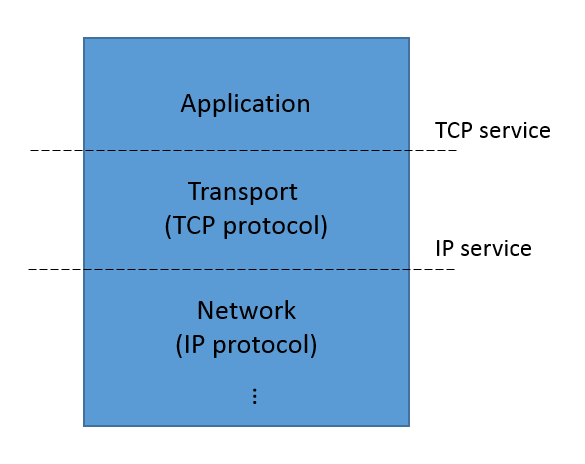

Formal verification is primarily about establishing relationships
between specifications at differing levels of abstraction. 

Consider, for example, a network protocol, such as the [TCP
protocol](https://en.wikipedia.org/wiki/Transmission_Control_Protocol)
that is widely used to communicate streams of data over the Internet.
At a high level of abstraction, TCP is a *service*, providing methods
for establishing connections, and sending or receive data. This
service provides guarantees to its users of reliable in-order
transmission of streams of bytes. At a lower level of abstraction, TCP
can be seen as a *protocol*. The protocol is a set of rules (laid out
in [RFC 675](https://tools.ietf.org/html/rfc675) and later documents)
that implements service guarantees of TCP by exchanging datagrams
over an unreliable network.

The service and protocol specifications of TCP are views of the same
process observed at different interfaces. That is, TCP is sandwiched
between a higher-level application (say, a web browser and web server)
and the lower-level datagram protocol (typically the IP protocol) as shown below:

The TCP service specification describes the events we observe at the
interface between the application layer and the transport layer.  The
IP service specification describes the events we observe at the
interface between the transport layer and the network layer.  The TCP
protocol specification describes the *relation* between events at this
interface and the lower-level interface between transport and network
layers.

If we were develping the TCP protocol specification, we would like to
verify that the IP service and the TCP protocol together implement the
TCP service specification. That is, if events at the transport/network
interface are consistent with the IP service specification, and if we
execute the TCP protocol according to its specification, then events
at the application/transport interface should be consistent with the TCP
service specification. From the point of view of the TCP protocol, we
say that the IP service specification is an *assumption*, while the
TCP service specification is a *guarantee*. 

Ivy has features that allow us to perform this kind of reasoning. It allows us to:

- Define objects with interfaces
- Write specifications about interfaces
- Prove assume/guarantee relationships between these specifications

In Ivy, interfaces and specifications are objects. An interface is
object with unimplemented actions (a bit like an instance of an
abstract class in C++). A specification is a special object that
monitors the calls and returns across an interface.

### Monitors as specifications

To specify services such as TCP, we need to make statements about the
*sequences* of events that can occur at an interface. For example, in
TCP, we need to make statements relating the sequences of send and
receive events to abstract data streams that are transmitted between
clients. Specifications about sequences of events in time are often
referred to as *temporal* specifications.

A common approach to tempral specification is to define a specialized
logical notation called a [*temporal
logic*](http://plato.stanford.edu/entries/logic-temporal). These
notations make it possible to write succinct temporal specifications,
and also us to do some proofs in a fully automated way using [model
checking](http://www.loria.fr/~merz/papers/mc-tutorial.pdf).

For reasons we will discuss shortly, Ivy takes a different approach.
Temporal specifications in Ivy are defined using special objects
called *monitors*. A monitor is an object that synchronizes its
actions with calls and returns across an interface. This allows the
monitor to record information about the history of the interface in
its local state, and to assert facts that should be true about
inteface events based on the history of previous events.

As an example, here is a definition of an interface for a rediculously
simple network service:
 
    #lang ivy1.7
    type packet

    object intf = {
        action send(x:packet)
        action recv(x:packet)
    }

The actions in an interface object don't have definitions. These will
be filled in by other objects that implement the different roles in
the interface. We don't know yet what these objects actually do, but
we can write a service specification that tells us something about the
temporal behavior at the interface:

    specification {

        relation sent(X:packet)

        after init {
            sent(X) := false
        }

        before intf.send {
            sent(x) := true
        }

        before intf.recv {
            require sent(x)
        }
    }

The `specification` section contains a monitor. This is imaginary code that is not
normally executed (often referred to as "ghost" code).
The monitor has one local state
component `sent` that records the set of packets that have been sent
so far. This information is recorded by inserting an action *before*
every call to `intf.send`. This is done using a new declaration
`before`. Notice that the inserted action can refer to the parameters
of `intf.send` and it can update the monitor state.  In addition, the
monitor inserts an assertion before every call to `intf.recv`. This
assertion is introduced with the `require` statement. This means that
the calling environment of `inft.recv` must guarantee that the
condition `sent(x)` holds before the call to `intf.send`. That is, the
received packet `x` must previously have been sent.

In effect, our service specification describes a channel that can
re-order and duplicate packets, but cannot corrupt packets. If any
corrupted packet is received, the assertion will fail.

Now let's consider some possible implementations of this very simple
specification. Here is the most trivial one:

    implementation {
        implement intf.send {
            call intf.recv(x)
        }
    }

The `implementation` section provides the implementation of action `intf.send`
using a new declaration `implement`. This declaration provides the
missing body of the action `intf.send`. The implementation simply calls `intf.recv`
on the sent packet `x`. The assertion in the monitor is always
true, since before calling `intf.send`, the packet `x` is added to the
relation `sent`. That is, our implementation trivially satisfies the
specification "receive only sent packets".

To verify our implementation, we need to put it in a suitable
environment. The following statements tell us that the environment
will implement `intf.recv` and will call `intf.send`:

    import intf.recv
    export intf.send

Now, saving this text in the file `trivnet.ivy`, we can check that our
"protocol" satisfies its service specification like this:

    $ ivy_check trivnet.ivy

    Isolate this:

        The following action implementations are present:
            trivnet.ivy: line 6: implementation of intf.recv
            trivnet.ivy: line 28: implementation of intf.send

        The following action monitors are present:
            trivnet.ivy: line 21: monitor of intf.recv
            trivnet.ivy: line 17: monitor of intf.send

        The following initializers are present:
            trivnet.ivy: line 13: init[after1]

        Any assertions in initializers must be checked ... PASS

        The following program assertions are treated as guarantees:
            in action intf.recv when called from intf.send:
                trivnet.ivy: line 21: guarantee ... PASS

    OK

For the moment, ignore the mysterious heading 'Isolate this:'. 
Ivy checked that the precondition of `intf.recv` is true whenever it
is called by `intf.send`. We don't even need an inductive invariant in
this case, because the assertion is true when `intf.send` is executed
in any context.

To get a better idea of what is happening with `before` and
`implements`, we can print out the program that results from inserting
the monitor actions and interface implementations:

    $ ivy_show trivnet.ivy

    type packet
    relation sent(V0:packet)

    after init {
        sent(X) := false
    }
    action intf.recv(x:packet) = {
        assert sent(x)
    }
    action intf.send(x:packet) = {
        {
            sent(x) := true;
            call intf.recv(x)
        }
    }
    export intf.send

Notice that the `before` actions of the monitor have been inserted at
the beginning of these actions, and the `implement` action of
`protocol` has been used as the body of `intf.send`. Notice also that
the `require` statement in the monitor has become `assert`. This means
that when `intf.recv` is called by our implementation, we have to
*prove* that the condition holds. 

Of course, we might consider a (slightly) less trivial implementation,
such as this one that implements the service specification with a
one-place buffer:

    implementation {

        individual full : bool
        individual contents : packet

        after init {
            full := false;
        }

        implement intf.send {
            full := true;
            contents := x
        }

        action async = {
            if full {
                full := false;
                call intf.recv(contents)
            }
        }
    }

This implementation has an action `async` that needs to be called by the
environment, so we add:

    export async

When `async` is called, if there is a message in the buffer, the message
is received. 
To verify this implementation, we also need one invariant conjecture:

    invariant full -> sent(contents)

That is, to show that when `async` executes, the received packet has
been sent, we need to know that the packet in the buffer has been
sent. The reader might want to try to produce this invariant using the
[interactive invariant generation
techniques](client_server_example.html) supported by Ivy.

### Assume-Guarantee reasoning in Ivy

In the previous example, we saw that a service specification is a kind
of abstraction. It hides details of the underlying imlementation,
telling us only what we need to know to use the service. Abstractions
are crucial in reasoning about complex systems. They allow us to
develop one component of a system without thinking about the details
of the implementation of other components. For example, when
developing a network application based on TCP, we don't have to read
RFC 675. We just rely on the simple service guarantee that TCP
provides (reliable, in-order delivery). The service specification
allows us to think about our application in *isolation* from the
network protocol stack.

Ivy provides a mechanism to do just this when proving correctness of
system components. That is, we can isolate a single object in our
system and prove its correctness using only the service specifications
of its interfaces.

As an example, let's build a system of two components that plays a
highly simplified game of ping-pong. Here is the interface definition:

    #lang ivy1.5

    object intf = {
        action ping
        action pong
    }

Here is the interface specification:

    type side_t = {left,right}

    specification {
        individual side : side_t
        after init {
            side := left
        }

        before intf.ping {
            require side = left;
            side := right
        }

        before intf.pong {
            require side = right;
            side := left
        }
    }

The specification section has a single state component `side` that keeps track
of whether the ball is on the left- or right-hand side of the
table. When the ball is on the left, a `ping` action is allowed,
sending the ball to the right-hand side.  When the ball is on the
right, a `pong` is allowed, sending the ball to the left again.  A
failure to alternate `ping` and `pong` would cause one of the
preconditions to fail.

Now let's implement the left-hand player:

    implementation {
        isolate left_player = {
            individual ball : bool
            after init {
                ball := true
            }

            action hit = {
                if ball {
                    call intf.ping;
                    ball := false
                }
            }

            implement intf.pong {
                ball := true
            }

            invariant ball -> side = left
        } with this
    }

The left player is a special kind of object called an `isolate`. An
isolate is verified in isolation.  The player has a Boolean state
variable `ball` that indicates the ball is in the player's court. We
assume the left player serves, so `ball` is initially true. If the
left player has the ball, the `hit` action will call `ping`, sending
the ball to the right, and set `ball` to false.  The left player
implements `ping` by setting `ball` to true (for the moment, ignore
the invariant, and also the declaration `with this`).

The right-hand player implementation is similar, except that it
reverses the roles of `ping` and `pong`, and initially its `ball`
variable is false:

    implementation {
        isolate right_player = {
            individual ball : bool
            after init {
                ball := false
            }

            action hit = {
                if ball {
                    call intf.pong;
                    ball := false
                }
            }

            implement intf.ping {
                ball := true
            }

            invariant ball -> side = right
        } with this
    }

Let's export the `hit` actions to the environment, so the players
will do something:

    export left_player.hit
    export right_player.hit

At this point we could easily enough verify the assertions using the
given invariant conjectures. However, by using `isolate` declarations,
we separate the reasoning about the left and right players, using the
top-level specification.  The top-level program is also an isolate,
called `this`. Each player isolate draws its assumptions and
guarantees from the the top-level specification. For this reason, each
is given a declaration `with this`.

We now have two separate proof problems, one for each player isolate.
We can see what the left player isolate looks like as
follows:

    $ ivy_show isolate=left_player pingpong.ivy

    type side_t = {left,right}
    individual side : {left,right}
    relation left_player.ball

    invariant [left_player.invar6] left_player.ball -> side = left

    after init {
        side := left
    }
    after init {
        left_player.ball := true
    }
    action intf.ping = {
        assert side = left;
        side := right
    }
    action left_player.hit = {
        if left_player.ball {
            call intf.ping;
            left_player.ball := false
        }
    }
    action intf.pong = {
        {
            assume side = right;
            side := left;
            left_player.ball := true
        }
    }
    export intf.pong
    export left_player.hit

Several interesting things have happened here. First, notice the the
action `intf.ping`. We see that the code inserted by the monitor is
present, but the implementation provided by `right_player` is missing.
In effect, the right player has been abstracted away: we see neither
its state nor its actions.  Further, notice that the action `pong` has
been exported to the environment. It contains the monitor code from
the top-level specification and also the left player's implementation of `pong`. There is a
crucial change, however: the `require` in the specification of `pong`
has changed to `assume`.

This is an example of assume-guarantee reasoning. The left player
*guarantees* to call `ping` only when the ball is on the
left. However, it *assumes* that the right player only calls `ping`
when the ball is on the right. This is a very common situation in protocols. 
Each participant in the protocol guarantees correctness of its outputs,
but only so long as its inputs are correct.

Finally, notice that the isolate contains only the left player's invariant
conjecture. Using this invariant, we can prove the correctness of `ping`:

    $ ivy_check isolate=left_player pingpong.ivy

    Isolate left_player:

        ...

        The following set of external actions must preserve the invariant:
            (internal) ext:intf.pong
                pingpong.ivy: line 45: left_player.invar6 ... PASS
            (internal) ext:left_player.hit
                pingpong.ivy: line 45: left_player.invar6 ... PASS

        The following program assertions are treated as assumptions:
            in action intf.pong when called from the environment:
                pingpong.ivy: line 22: assumption

        The following program assertions are treated as guarantees:
            in action intf.ping when called from left_player.hit:
                pingpong.ivy: line 17: guarantee ... PASS

    OK

We've shown only some interesting parts of Ivy's ouput. Notice first
that Ivy verifies that the two exported actions of the left player
isolate preserve the invariant conjecture of `left_player`. These are `intf.pong` and
`left_player.hit`. In addition, notice that Ivy treated the
precondition of `intf.pong` as an *assumption*, and the precondition
of `intf.ping` as a *guarantee*. It checked the guarantee given the
assumption and printed PASS to indicate the the guarantee holds.

Now let's look at the other isolate:

    $ ivy_show isolate=right_player pingpong.ivy

    type side_t = {left,right}
    individual side : {left,right}
    relation right_player.ball

    invariant [right_player.invar9] right_player.ball -> side = right

    after init {
        side := left
    }
    after init {
        right_player.ball := false
    }
    action intf.pong = {
        assert side = right;
        side := left
    }
    action right_player.hit = {
        if right_player.ball {
            call intf.pong;
            right_player.ball := false
        }
    }
    action intf.ping = {
        {
            assume side = left;
            side := right;
            right_player.ball := true
        }
    }
    export intf.ping
    export right_player.hit

This is similar, but now `pong` is verified and `ping` is assumed to be correct.
The state and actions of the left player are compeltely abstracted away. 

We can check the whole proof using Ivy like this:

    $ ivy_check pingpong.ivy 

    ...

    Isolate right_player:

        ...

        The following set of external actions must preserve the invariant:
            (internal) ext:intf.ping
                pingpong.ivy: line 65: right_player.invar9 ... PASS
            (internal) ext:right_player.hit
                pingpong.ivy: line 65: right_player.invar9 ... PASS

        The following program assertions are treated as assumptions:
            in action intf.ping when called from the environment:
                pingpong.ivy: line 17: assumption

        The following program assertions are treated as guarantees:
            in action intf.pong when called from right_player.hit:
                pingpong.ivy: line 22: guarantee ... PASS

    ...
    
    OK

Notice here, the assume/guarantee relation is reversed. We assume the
precondition of `intf.ping` when proving the precondition of
`intf.pong`.

## Is this really a proof?

In creating the two isolates `left_player` and `right_player`, we
reduced a proof goal to two simpler sub-goals. In theorem provers,
this kind of reduction is called a *tactic*.  We must take care that
our tactics are logically sound. That is, is the two sub-goals are
provable, then the original goal must also be provable.

Let's try informally to justify the soundness of our tactic. Ivy
performed two transformations to produce each isolate: it changed some
requiremens to assumptions or assertions, and it deleted the code of
one of the two players.

# Pseudo-circular proofs

At first blush, changing assertions to assumptions seems to be unsound
because of a logical circularity. That is, we assumed `ping` to prove
`pong` and `pong` to prove `ping`. This apparent circularity is broken
by the fact that when proving `ping`, we only assume `pong` has been
correct *in the past*.  When verifying `left_player`, we show that the
assertion about `ping` is not the first assertion to fail. When
verifying `right_player`, we show that the assertion about `pong` is not the
first assertion to fail. Since no assertion is the first to fail, we
know no assertion ever fails.

# Abstraction

In isolating the left player, Ivy deleted all the actions and state
components of the right player. This is a form of abstraction known as
*localization*.  The idea is that the truth of some assertions does not
depend on certain components of the system. But in what cases is this
a sound abstraction? That is, when can we infer that an assertion is true
from the fact that it is true in the abstracted system? A sufficient
condition is that the abstracted actions can have no side effect that
is visible to the remaining actions. We will call this condition
*non-interference*.

Ivy uses a fairly simple analysis to check non-interference. As an example,
suppose the right player tries to cheat by putting the ball back in 
the left player's court without hitting it:

    isolate right_player = {

        ...

        implement intf.ping {
            left_player.ball := true
        }

        ...
    }

Here's what happens when when we try to verify this version:

    ivy_check interference.ivy

    Isolate left_player:
    interference.ivy: line 30: error: Call out to intf.ping may have visible effect on left_player.ball

Ivy can't abstract away the right player's implementation of
`intf.ping` because of the possible side effect on `left_player.ball`.
Ivy's analysis of interference is based only on which state components
are referenced and assigned. It's easy to construct an example where
two objects share a variable, but do not actually interfere, for
example, because they reference disjoint elements of an array. Ivy
will flag this as an error, since its analysis is not precise enough
to show non-interference. Ivy is designed to reason about objects that
share interfaces, but not variables.

# Coverage

To be sound, our tactic must also ensure that every assertion in the
program is verified in some isolate. Ivy checks this for us. Suppose, for example, we remove the
`with this` declaration from the `right_player` isolate.
Here is what happens when we try to verify the program:

    ivy_check coveragefail.ivy
    coveragefail.ivy: line 20: error: assertion is not checked
    coveragefail.ivy: line 5: error: ...in action intf.pong
    coveragefail.ivy: line 49: error: ...when called from right_player.hit
    error: Some assertions are not checked

Ivy is telling us that the precondition of `pong` assertion isn't checked, because we
haven't declared the top-level specification as a dependency of `right_player`.

## The isolate declaration

Now let's look at the `isolate` declaration in more detail. Here is the declaration
of the `left_player` isolate:

    isolate left_player = {
        ...
    } with this

This creates an isolate named `left_player` in whose guarantees are
checked in contect of the top-level isolate's specification.
In this process, the actions of all isolates except for `left_player` and
`this` are erased (assuming they are non-interfering). If we
didn't include `this` in the `with` part of the declaration, then
`this` would be abstracted away, and no assertions would be checked
(leading to an error message similar to the one above).

The remaining question is how Ivy decides which assertions are
guarantees for `left_player` and which are assumptions. The default
rules are as follows.

A *guarantee* for a given isolate is:

- a `require` assertion in another isolate it calls into, or
- an `ensure` assertion of the isolate itself.

An *assumption* for a given object is:

- a `require` assertion of the isolate itself, or
- a `ensure` assertion of an isolate it calls into.

(`after` monitors and `ensure` assertions will be introduced in the next section).

This roughly corresponds to the intuition that an object makes
assumptions about its inputs and guarantees about its outputs.

## What we prove

If all isolates are verified, and if Ivy's non-interference and
coverage checks succeed, then we can infer that all assertions in the
program are true at all times in all executions of the program.  In
this case, `ivy_check` prints `OK`.

