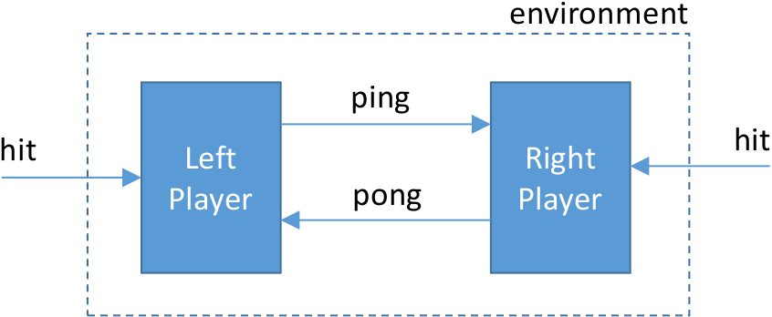

Formal verification is primarily about establishing relationships
between specifications at differing levels of abstraction. The same
can be said of compositional testing. The difference is that in the
compositional testing approach, we combine formal proof with
specification-based testing to increase our confidence in the
correctness of a system.

Consider, for example, a network protocol, such as the [TCP
protocol](https://en.wikipedia.org/wiki/Transmission_Control_Protocol)
that is widely used to communicate streams of data over the Internet.
At a high level of abstraction, TCP is a *service*, providing methods
for establishing connections, and sending or receiving data. This
service provides guarantees to its users of reliable in-order
transmission of streams of bytes. At a lower level of abstraction, TCP
can be seen as a *protocol*. The protocol is a set of rules (laid out
in [RFC 675](https://tools.ietf.org/html/rfc675) and later documents)
that implements service guarantees of TCP by exchanging datagrams over
an unreliable network.

The service and protocol specifications of TCP are views of the same
process observed at different interfaces. That is, TCP is sandwiched
between a higher-level application (say, a web browser and web server)
and the lower-level datagram protocol (typically the IP protocol) as shown below:

The TCP service specification describes the events we observe at the
interface between the application layer and the transport layer.  The
IP service specification describes the events we observe at the
interface between the transport layer and the network layer.  The TCP
protocol specification describes the *relation* between events at this
interface and the lower-level interface between transport and network
layers.

If we were developing the TCP protocol specification, we would like to
verify that the IP service and the TCP protocol together implement the
TCP service specification. That is, if events at the transport/network
interface are consistent with the IP service specification, and if we
execute the TCP protocol according to its specification, then events
at the application/transport interface should be consistent with the TCP
service specification. From the point of view of the TCP protocol, we
say that the IP service specification is an *assumption*, while the
TCP service specification is a *guarantee*. 

IVy has features that allow us to combine testing with formal
verification to perform this kind of reasoning. It allows us to:

- Define objects with interfaces
- Write specifications about interfaces
- Test assume/guarantee relationships between these specifications

In IVy, interfaces and specifications are objects. An interface is
an object with unimplemented actions (a bit like an instance of an
abstract class in C++). A specification is a special object that
monitors the calls and returns across an interface and makes assertions
about their correctness.

### Monitors as specifications

To specify services such as TCP, we need to make assertions about the
*sequences* of events that can occur at an interface. For example, in
TCP, we need to make statements relating the sequences of send and
receive events to abstract data streams that are transmitted between
clients. Specifications about sequences of events in time are often
referred to as *temporal* specifications.

A common approach to temporal specification is to define a specialized
logical notation called a [*temporal
logic*](http://plato.stanford.edu/entries/logic-temporal). These
notations make it possible to write succinct temporal specifications,
and also us to do some proofs in a fully automated way using [model
checking](http://www.loria.fr/~merz/papers/mc-tutorial.pdf).

IVy takes a different approach.  Temporal specifications in IVy are
defined using special objects called *monitors*. A monitor is an
object that synchronizes its actions with calls and returns across an
interface. This allows the monitor to record information about the
history of the interface in its local state, and to assert facts that
should be true about interface events based on the history of previous
events.

As an example, here is a definition of an interface for a ridiculously
simple network service:
 
    #lang ivy1.6
    type packet

    object intf = {
        action send(x:packet)
        action recv(x:packet)
    }

The type `packet` is an example of an [*uninterpreted type*](../../language.html#declarations). We don't
yet know want the contents of a packet are, but we can fill in the
definition of `packet` later.

The actions in an interface object don't have definitions. These will
be filled in by other objects that implement the different roles in
the interface. We don't know yet what these objects actually do, but
we can write a service specification that tells us something about the
temporal behavior at the interface:

    object spec = {
        relation sent(X:packet)

        after init {
            sent(X) := false
        }

        before intf.send {
            sent(x) := true
        }

        before intf.recv {
            assert sent(x)
        }
    }

Object `spec` is a monitor. It has one local state component `sent`
that records the set of packets that have been sent so far.  The
`after init` declaration says that, initially, no packet `X` has been sent.
In [the Ivy language](../../language.html), symbols beginning with
capital letters are logical variables. Unbound variables are
implicitly universally quantified.

Information about sent packets is recorded by inserting an action
*before* every call to `intf.send`. This is done using a `before`
declaration in the specification. Notice that the inserted action can
refer to the parameters of `intf.send` and it can update the monitor
state.  In addition, the monitor inserts an assertion before every
call to `intf.recv`. This assertion states that the received packet
`x` has previously been sent.

In effect, our service specification describes a channel that can
re-order and duplicate packets, but cannot corrupt packets. If any
corrupted packet is received, the assertion will fail.

Now let's consider some possible implementations of this very simple
specification. Here is the most trivial one:

    object protocol = {
        implement intf.send {
            call intf.recv(x)
        }
    }

Object `protocol` provides the implementation of action `intf.send`
using an `implement` declaration. This declaration provides the
missing body of the action `intf.send`. The implementation simply calls `intf.recv`
on the sent packet `x`. The assertion in monitor `spec` is always
true, since before calling `intf.send`, the packet `x` is added to the
relation `sent`. That is, our implementation trivially satisfies the
specification "receive only sent packets".

To verify our implementation, we need to put it in a suitable
environment. The following statements tell us that the environment
will implement `intf.recv` and will call `intf.send`:

    import intf.recv
    export intf.send

In order to test our program, we need to give a concrete interpretation to
the abstract type `packet`. It doesn't much matter what this interpretation is.
This statement tells IVy to represent packets using 16-bit binary numbers:

    interpret packet -> bv[16]

Now, let's do some verification. The IVy compiler can translate our
program into C++, and also generate a randomized tester that takes the
role of the environment. We save the above text to the file
`trivnet.ivy`, then compile like this:

    $ ivy_to_cpp target=test build=true trivnet.ivy
    g++ -I $Z3DIR/include -L $Z3DIR/lib -g -o trivnet trivnet.cpp -lz3

The command line options tell `ivy_to_cpp` to generate a test environment
and to use the C++ compiler to generate an executable file. When we run the
executable, the output looks like this:

    ./trivnet
    > intf.send(61468)
    < intf.recv(61468)
    > intf.send(49878)
    < intf.recv(49878)
    > intf.send(18736)
    < intf.recv(18736)
    > intf.send(41051)
    < intf.recv(41051)
    ...

The output lines beginning with `>` represent calls from the test
environment into the system, while lines beginning with `<` are calls
from the system into the environment. The specification monitor is
checking that every call to `intf.recv` corresponds to some previous
call to `intf.send`. This input values are just random 16-bit
numbers. Since our implementation is correct, no errors are flagged.

To get a better idea of what is happening with `before` and
`implements`, we can print out the program that results from inserting
the monitor actions and interface implementations. Here is part of the output:

    $ ivy_show trivnet.ivy

    type packet
    relation spec.sent(V0:packet)

    after init {
        spec.sent(X) := false
    }
    action intf.recv(x:packet) = {
        assert spec.sent(x)
    }
    action intf.send(x:packet) = {
        spec.sent(x) := true;
        call intf.recv(x)
    }

Notice that the `before` actions of `spec` have been inserted at the
beginning of these actions, and the `implement` action of `protocol`
has been used as the body of `intf.send`.

Of course, we might consider a (slightly) less trivial implementation,
such as this one that implements the service specification with a
one-place buffer:

    object protocol = {
        individual full : bool
        individual contents : packet
        after init {
            full := false
        }

        implement intf.send {
            full := true;
            contents := x
        }

        action async = {
            if full {
                full := false;
                call intf.recv(contents)
            }
        }
    }

This implementation has an action `async` that needs to be called by the
environment, so we add:

    export protocol.async

The output from the tester looks like this:

    ./trivnet2
    > intf.send(59132)
    > intf.send(18535)
    > protocol.async()
    < intf.recv(18535)
    > intf.send(11708)
    > intf.send(15030)
    > protocol.async()
    < intf.recv(15030)
    > intf.send(64574)
    > intf.send(23863)
    > intf.send(63393)
    > protocol.async()
    < intf.recv(63393)

The tester is calling `intf.send` and `protocol.async` uniformly at
random (with a probability of 0.5 for each). We can see that some
packets (for example the first) are dropped.

Let's put a bug in the protocol to see what happens. The action
`bug` below corrupts the packet buffer:

        action bug(p:packet) = {
            contents := p
        }

    ...
 
    export protocol.bug

Here's a test run:

    ./trivnet3
    > protocol.async()
    > protocol.async()
    > intf.send(18535)
    > protocol.bug(61184)
    > intf.send(31188)
    > intf.send(18749)
    > protocol.async()
    < intf.recv(18749)
    > protocol.bug(6178)
    > intf.send(28724)
    > protocol.bug(45283)
    > protocol.bug(6070)
    > protocol.bug(2590)
    > protocol.bug(10158)
    > protocol.async()
    trivnet3.ivy: line 22: : assertion failed

At some point, the environment calls `bug` then `async` causing the
protocol to deliver a wrong packet value. We can see that the
specification monitor is in fact running, and it gives an error
message pointing to the line in the code where an assertion failed.

### Assume-Guarantee reasoning in IVy

In the previous example, we saw that a service specification is a kind
of abstraction. It hides details of the underlying implementation,
telling us only what we need to know to use the service. Abstractions
are crucial in reasoning about complex systems. They allow us to
develop one component of a system without thinking about the details
of the implementation of other components. For example, when
developing a network application based on TCP, we don't have to read
RFC 675. We just rely on the simple service guarantee that TCP
provides (reliable, in-order delivery). The service specification
allows us to think about our application in *isolation* from the
network protocol stack.

IVy provides a mechanism to do just this when proving correctness of
system components. That is, we can isolate a single object in our
system and prove its correctness using only the service specifications
of its interfaces.

As an example, let's build a system of two components that plays a
highly simplified game of ping-pong. Here is the interface definition:

    #lang ivy1.6

    object intf = {
        action ping
        action pong
    }

Here is the interface specification:

    type side_t = {left,right}

    object spec = {
        individual side : side_t
        after init {
            side := left
        }

        before intf.ping {
            assert side = left;
            side := right
        }

        before intf.pong {
            assert side = right;
            side := left
        }
    }

The specification has a single state component `side` that keeps track
of whether the ball is on the left- or right-hand side of the
table. When the ball is on the left, a `ping` action is allowed,
sending the ball to the right-hand side.  When the ball is on the
right, a `pong` is allowed, sending the ball to the left again.  A
failure to alternate `ping` and `pong` would cause one of the
assertions to fail.

Now let's implement the left-hand player:

    object left_player = {
        individual ball : bool
        after init {
            ball := true
        }

        action hit = {
            if ball {
                call intf.ping;
                ball := false
            }
        }

        implement intf.pong {
            ball := true
        }

    }

The player has a Boolean `ball` that indicates the ball is in the
player's court. We assume the left player serves, so `ball` is
initially true. If the left player has the ball, the `hit` action
will call `ping`, sending the ball to the right, and set `ball` to false.  The
left player implements `ping` by setting `ball` to true.

The right-hand player is similar:

    object right_player = {
        individual ball : bool
        after init {
            ball := false
        }

        action hit = {
            if ball {
                call intf.pong;
                ball := false
            }
        }

        implement intf.ping {
            ball := true
        }

    }

Let's export the `hit` actions to the environment, so the players
will do something:

    export left_player.hit
    export right_player.hit

Here is the call graph of the system we have defined:

Now what we want to do is to generate testers for the left and right
players in isolation. That is, we want the tester for the left player
to act as its environment. This means the tester has to call both
`left_player.hit` and `intf.pong`. Similarly, the tester for the right
player has to call `right_player.hit` and `intf.ping`. 

To generate these testers, we use `isolate` declarations:

    isolate iso_l = left_player with spec
    isolate iso_r = right_player with spec

The first says to isolate the left player using the interface
specification `spec`.  The second says to do the same thing with the
right player. This reduces the system verification problem to two
separate verification problems called "isolates".

Here's the call graph for the left player isolate `iso_l`:

We can see what the first isolate looks like textually as follows (leaving a few
things out):

    $ ivy_show isolate=iso_l pingpong.ivy

    individual spec.side : side_t
    relation left_player.ball

    action ext:left_player.hit = {
        if left_player.ball {
            call intf.ping;
            left_player.ball := false
        }
    }

    action intf.ping = {
        assert spec.side = left;
        spec.side := right
    }

    action ext:intf.pong = {
        assume spec.side = right;
        spec.side := left;
        left_player.ball := true
    }

Several interesting things have happened here. First, notice the
action `intf.ping`. We see that the code inserted by `spec` is
present, but the implementation provided by `right_player` is missing.
In effect, the right player has been abstracted away: we see neither
its state nor its actions.  Further, notice that the action `pong` has
been exported to the environment. It contains the monitor code from
`spec` and also the left player's implementation of `pong`. There is a
crucial change, however: the `assert` in the specification of `pong`
has changed to `assume`.

This is an example of *assume-guarantee* reasoning. The left player
*guarantees* to call `ping` only when the ball is on the
left. However, it *assumes* that the right player only calls `pong`
when the ball is on the right. This is a very common situation in protocols. 
Each participant in the protocol guarantees correctness of its outputs,
but only so long as its inputs are correct.

Let's start by testing the left player. First, we compile a tester:

    $ ivy_to_cpp isolate=iso_l target=test build=true pingpong.ivy 
    g++ -I $Z3DIR/include -L $Z3DIR/lib -g -o pingpong pingpong.cpp -lz3

Notice we specified the isolate `iso_l` on the command line.  Now
let's run `pingpong`:

    $ ./pingpong
    > left_player.hit()
    < intf.ping
    > left_player.hit()
    > intf.pong()
    > left_player.hit()
    < intf.ping
    > left_player.hit()
    > intf.pong()
    > left_player.hit()
    < intf.ping
    ...

We can see that the environment (the calls marked with `>`) is
respecting the assumption of the left player that `pong` occurs only
when the ball is on the right, that is, after a `ping`. The tester is
sampling uniformly out of just the actions that satisfy the isolate's
assumptions. You may notice that sometimes the environment calls `hit`
when the left player doesn't have the ball. This is not a problem,
since a `hit` has no effect in this case. What if we neglected to test whether the left player in fact has the ball in the implementation?
Let's try it. That is, let's use this version of the left player's `hit` action:

    action hit = {
        call intf.ping;
        ball := false
    }

Here's what we get:

    $ ./pingpong_bad
    > left_player.hit()
    < intf.ping
    > left_player.hit()
    pingpong_bad.ivy: line 15: : assertion failed

The left player hits when it shouldn't and causes a failure of the
precondition of `ping`.

Now let's consider try right player. We compile and run a tester for
the isolate `iso_r`:

    $ ivy_to_cpp isolate=iso_r target=test build=true pingpong.ivy 
    g++ -I $Z3DIR/include -L $Z3DIR/lib -g -o pingpong pingpong.cpp -lz3
    $ ./pingpong
    > right_player.hit
    > right_player.hit
    > right_player.hit
    > intf.ping
    > right_player.hit
    < intf.pong
    > right_player.hit
    > intf.ping
    > right_player.hit
    < intf.pong
    > intf.ping

Here we see that the testing environment is generating calls to `ping`
and right_player.hit. The `ping` calls satisfy the precondition of
`ping`, that is, `ping` is only called when the ball is on the left
side. The specification monitor is checking that the `pong` calls
generated by the right player satisfy the precondition of `pong`.

So what have we done so far? We've verified by randomized testing the
the left player guarantees correct pings assuming correct pongs. We've
also verified by testing that the right player guarantees correct pongs
given correct pings. Since neither the pings nor the pongs can be the
first to fail, we can conclude that all pings and pongs are correct
according to the specification.

We can ask IVY to check this conclusion for us:

    $ ivy_check trusted=true pingpong.ivy 
    Checking isolate iso_l...
    Checking isolate iso_r...
    OK

The option `trusted=true` tells IVy to trust that the specified
isolates are correct, facts that we have tested, but not formally
verified. IVy says it can prove based on this assumption that all of
our assertions are true at all times.

## Is this really a proof?

In creating the two isolates `iso_l` and `iso_r`, we reduced a proof
goal to two simpler sub-goals. In theorem provers, this kind of
reduction is called a *tactic*.  We must take care that our tactics
are logically sound. That is, is the two sub-goals are provable, then
the original goal must also be provable.

Let's try informally to justify the soundness of our tactic. Ivy
performed two transformations to produce each isolate: it changed some
assertions to assumptions, and it deleted the actions and state components of
one of the two players.

# Pseudo-circular proofs

At first blush, changing assertions to assumptions seems to be unsound
because of a logical circularity. That is, we assumed `ping` to prove
`pong` and `pong` to prove `ping`. This apparent circularity is broken
by the fact that when proving `ping`, we only assume `pong` has been
correct *in the past*.  When verifying `iso_l`, we show that the
assertion about `ping` is not the first assertion to fail. When
verifying `iso_r`, we show that the assertion about `pong` is not the
first assertion to fail. Since no assertion is the first to fail, we
know no assertion ever fails (this is an argument by [induction](https://en.wikipedia.org/wiki/Mathematical_induction) over time).

# Abstraction

In isolating the left player, IVy deleted all the actions and state
components of the right player. This is a form of abstraction known as
*localization*.  The idea is that the truth of some assertions does not
depend on certain components of the system. But in what cases is this
a sound abstraction? That is, when can we infer that an assertion is true
from the fact that it is true in the abstracted system? A sufficient
condition is that the abstracted actions can have no side effect that
is visible to the remaining actions. We will call this condition
*non-interference*.

IVy uses a fairly simple analysis to check non-interference. As an example,
suppose the right player tries to cheat by putting the ball back in 
the left player's court without hitting it:

    object right_player = {

        ...

        implement intf.ping {
            left_player.ball := true
        }

        ...
    }

Here's what happens when when we try to verify this version:

    $ ivy_check trusted=true interference.ivy 
    Checking isolate iso_l...
    interference.ivy: line 30: error: Call out to right_player.intf_ping[implement] may have visible effect on left_player.ball
    interference.ivy: line 37: referenced here
    interference.ivy: line 20: referenced here
    interference.ivy: line 30: referenced here
    interference.ivy: line 27: referenced here

IVy can't abstract away the right player's implementation of
`intf.ping` because of the possible side effect on `left_player.ball`.
IVy's analysis of interference is based only on which state components
are referenced and assigned. It's easy to construct an example where
two objects share a variable, but do not actually interfere, for
example, because they reference disjoint elements of an array. IVy
will flag this as an error, since its analysis is not precise enough
to show non-interference. IVy is designed to reason about objects that
share interfaces, but not variables.

# Coverage

To be sound, our tactic must also ensure that every assertion in the
program is verified in some isolate. IVy checks this for us. Suppose, for example, we remove this
isolate declaration from our ping-pong program:

    isolate iso_r = right_player with spec

Here is what happens when we try to verify [the program](coveragefail.ivy):

    $ ivy_check trusted=true  coveragefail.ivy
    coveragefail.ivy: line 20: error: assertion is not checked
    coveragefail.ivy: line 5: error: ...in action intf.pong
    coveragefail.ivy: line 49: error: ...when called from right_player.hit
    error: Some assertions are not checked

IVy is telling us that the precondition of action `pong` isn't checked
when it's called from `right_player`, because we haven't created an
isolate for `right_player`.

## The isolate declaration

Now let's look at the `isolate` declaration in more detail. Here is the declaration
that isolates the left player:

    isolate iso_l = left_player with spec

This creates an isolate named `iso_l` in which the guarantees of `left_player` are
checked. The actions of all objects except for `left_player` and
`spec` are abstracted away (assuming they are non-interfering). If we
didn't include `spec` in the `with` part of the declaration, then
`spec` would be abstracted away, and no assertions would be checked
(leading to an error message similar to the one above).

The remaining question is how IVy decides which assertions are
guarantees for `left_player` and which are assumptions. The default
rules are as follows.

A *guarantee* for a given object is any assertion occurring in:

- An implementation provided by the object
- A `before` monitor of an action called by the object
- An `after` monitor of an implementation provided by the object

An *assumption* for a given object is any assertion occurring in:

- A `before` monitor of an implementation provided by the object
- An `after` monitor action called by the object

(`after` specifications will be introduced in the next section).

This roughly corresponds to the intuition that an object makes
assumptions about its inputs and guarantees about its outputs.

## So what have we proved?

If all isolates are correct, and if IVy's non-interference and
coverage checks succeed, then we can infer that all assertions in the
program are true at all times in all executions of the program. In
this case, `ivy_check` prints `OK`. Of course, we only verified the
isolates by randomized testing. This means there is a risk that we
missed a bug in a system component. Because IVy checked our
assume/guarantee proof, however, we know that if the whole system has
a bug, then one of the isolates must have a bug. If we test the
isolates long enough, we will eventually find it without testing the
system as a whole. 

